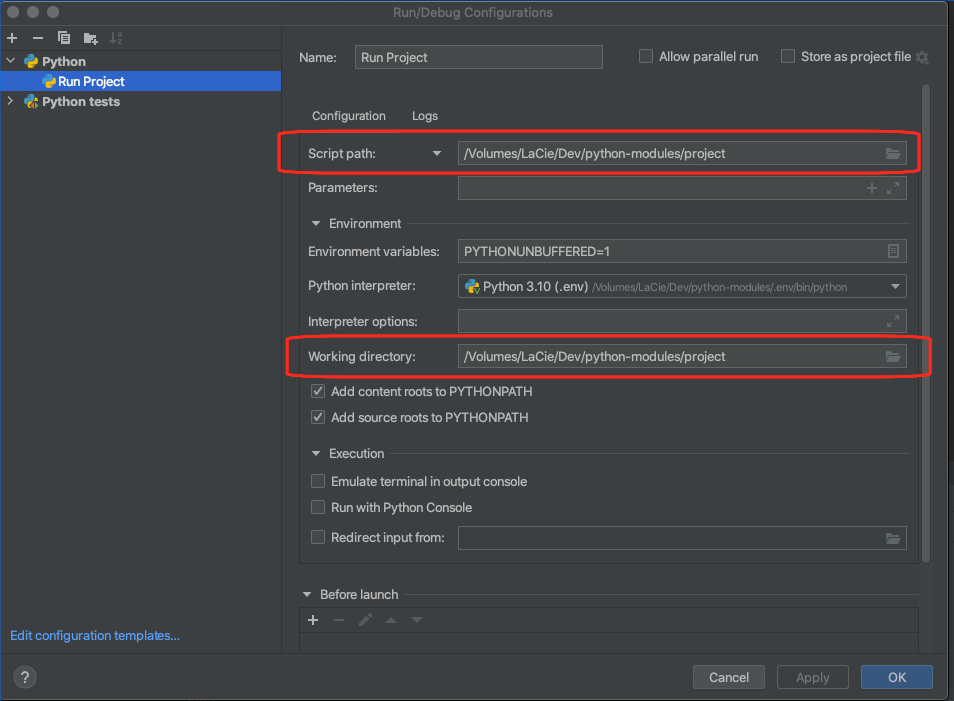

# Python Modules Demo

## Introduction

This repository contains two simple python projects that demonstrates how the import process works.

- The folder named 'project' contains an application that can be run from the command line and includes an internal module as well as a sample test script
- The folder name 'lib' contains a package that is imported into the 'project' application

## IDE

The checked in code includes a .editorconfig in order to allow as many editors as possible to make use of the settings.  The project was developed using the community version of PyCharm and the screen captures below are based on it.

## Lib

The lib folder contains a Python package with one simple class that prints out a greeting.

The package can be added to the project by selection the Python Packages tab at the bottom of the screen and selecting from disk in the Add Package menu:


Once the process completes the package ('lib') and be seen in the list of installed packages.  The package can be imported into your python file using the
statement:

```
import lib
```

And an instance of the class from the package can be created as follows:

```
external = lib.ExternalGreeter('External')
```

## Project

The project folder contains the actual application that consumes the lib package and displays the output.  This is the basic folder structure I use from my projects:


The src folder contains the application specific code and is defined as a package, so it can be imported as:

```
import src
```

And the test contains various scripts that are used to test the application code.  It to is defined as a package.

## Run Application

The IDE is configured to run the application as follows:



The script path points to the root folder of the application, where the program's entry point is located in the __main__.py file

Not the the Working directory also points to the root folder of the application

## Run Tests

The IDE is configured to run the application as follows:


The target is set to script path and points to the folder containing the test scripts.

Not the the Working directory also points to the root folder of the application
